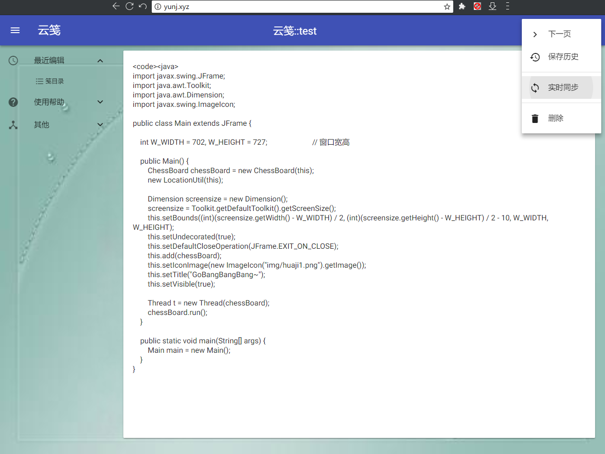
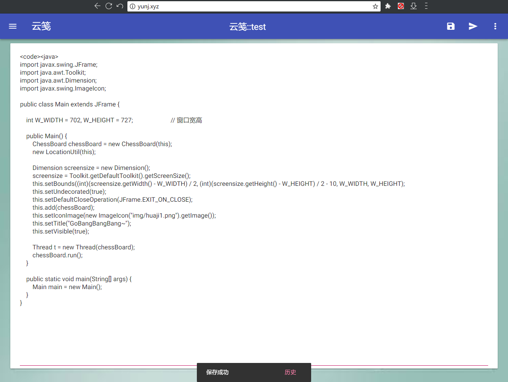
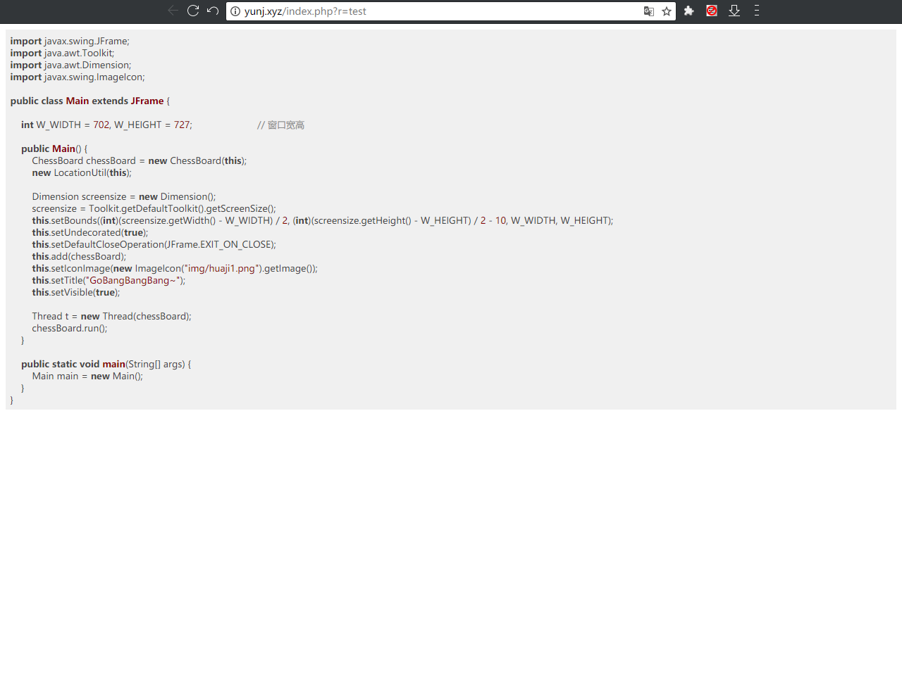
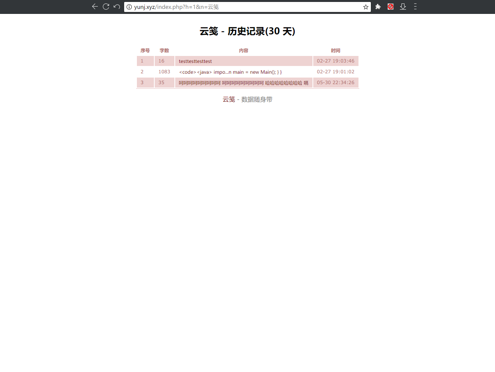

# 云笺

## 简介

云笺 2.0 极致轻量级云笔记，Material Design 简约风格，无需登录，实时同步

支持文字保存、资料分享、代码展示、历史记录、网址重定向、短网址压缩，能使用HTML、JS、CSS来美化界面；

还有无限级子页面、多用户多设备同一页内容实时同步，甚至可以用作匿名在线聊天……

以及为多款工具提供文字分享接口.

身边用过的人都说好用。 网址：http://yunj.xyz  

## 页面功能

**用下划线+数字，例如 “_1” 来标识页面**
`yunj_1` 第一页
`yunj_2` 第二页
以此推类

末尾添加下划线  **_**  来表示一个目录
例如：`yunj_`  显示以 yunj 开头的所有笔记

## 语法功能

**前缀**加上下面尖括号及其内单词有特殊效果：

- `<title>`页面标题
- `<code>`作为代码展示
- `<title>` `<cpp>`作为C语言代码展示，此外还有java、HTML等近百种编程语言
- `<url>`网址重定向（可用于缩短网址）

支持部分HTML标签，可自己适当添加。
尖括号外的空格、换行等内容都将保留。

快速**打开**网址：`yunj.xyz?n=标题`
快速**阅读**网址：`yunj.xyz?r=分享码`
**分享码**可自定义，只需在标题后加上两个英文冒号再加上分享码，格式为   `标题::分享码`，例如：`hhh::h`

## 历史记录功能

保存30天（事实上长期保存，不删除）的历史记录

每次保存时间超过10分钟、或者字数改变超过50字，都会生成一条历史记录。

## 实时同步

在菜单中点击“实时同步”，那么数据库中修改内容时会立即同步到您的浏览器中。

如果有内容修改，则会进行一系列的判断，最终较为智能地选择正确的方案。（并不是彻底的多人同时在线编辑）

可用于实时聊天，但是实测并不怎么稳定（可能是由于服务器网速太慢了）。

## 条款

仅提供存储功能，严禁存储违法内容！

任何后果请使用者自己负责！ 

## 开源项目

使用了 [MDUI](https://www.mdui.org/) 框架，以及两项代码高亮的库。

## 搭建

建议工具为 phpStudy+navicat。版本关系不是很大，php5.3+都能用。

数据库需要导入，即 “数据库.sql” 文件。